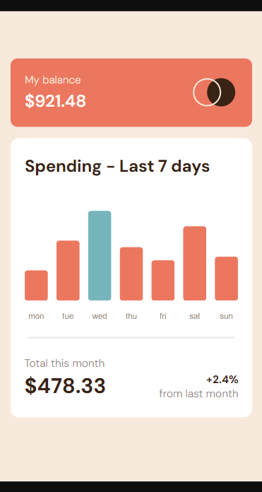
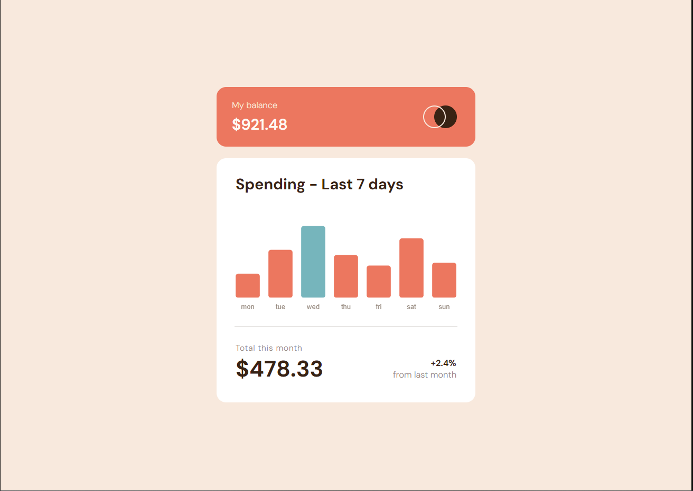

# Frontend Mentor - Expenses chart component solution

This is a solution to the [Expenses chart component challenge on Frontend Mentor](https://www.frontendmentor.io/challenges/expenses-chart-component-e7yJBUdjwt). Frontend Mentor challenges help you improve your coding skills by building realistic projects.

## Table of contents

- [Overview](#overview)
  - [The challenge](#the-challenge)
  - [Screenshot](#screenshot)
  - [Links](#links)
- [My process](#my-process)
  - [Built with](#built-with)
  - [What I learned](#what-i-learned)
  - [Continued development](#continued-development)
  - [Useful resources](#useful-resources)
- [Author](#author)
- [Acknowledgments](#acknowledgments)

**Note: Delete this note and update the table of contents based on what sections you keep.**

## Overview

### The challenge

Users should be able to:

- View the bar chart and hover over the individual bars to see the correct amounts for each day
- See the current day’s bar highlighted in a different colour to the other bars
- View the optimal layout for the content depending on their device’s screen size
- See hover states for all interactive elements on the page
- **Bonus**: Use the JSON data file provided to dynamically size the bars on the chart

### Screenshot

### Links

- Solution URL: [https://github.com/sjohnston82/expenses-chart-component](https://github.com/sjohnston82/expenses-chart-component)
- Live Site URL: [https://brilliant-sunshine-87d7aa.netlify.app/](https://brilliant-sunshine-87d7aa.netlify.app/)

## My process

### Built with

- Typescript
- TailwindCSS
- Flexbox
- ChartJS
- Mobile-first workflow
- [React](https://reactjs.org/) - JS library
- [Next.js](https://nextjs.org/) - React framework

### What I learned

This one was tricky for me. I decided I wanted to make it dynamic and to use ChartJS because I had never used it before and thought this project would be a good way to get my feet wet. While I did learn a lot about ChartJS I spent way more time trying to figure out how to configure every little detail to make it as pixel perfect to the design copy than it would have taken me to write the chart myself. I import the json data and then map over it to create the bars and labels.

## Author

- Website - [Stephen Johnston](https://www.stephenmjohnston.net)
- Frontend Mentor - [@sjohnston82](https://www.frontendmentor.io/profile/sjohnston82)
